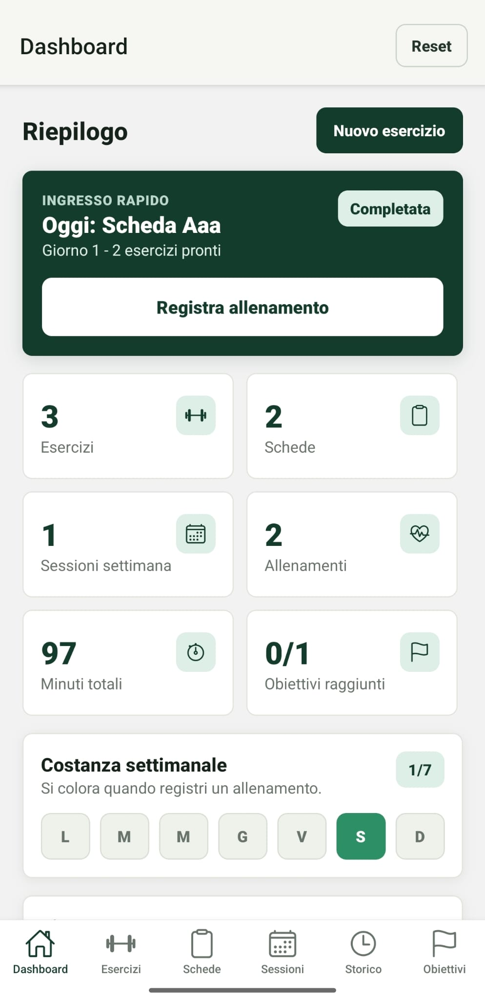
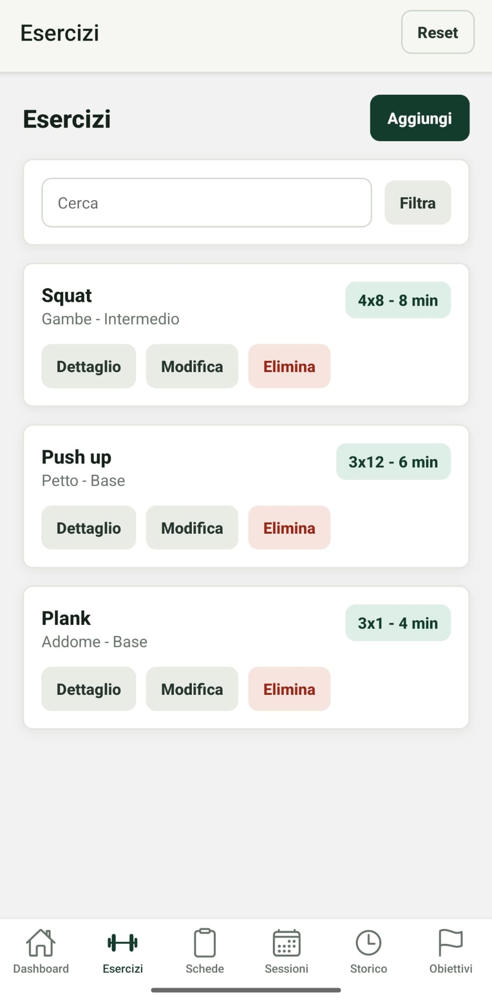
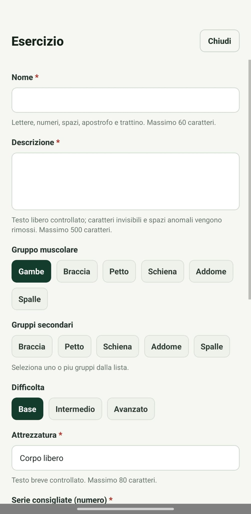
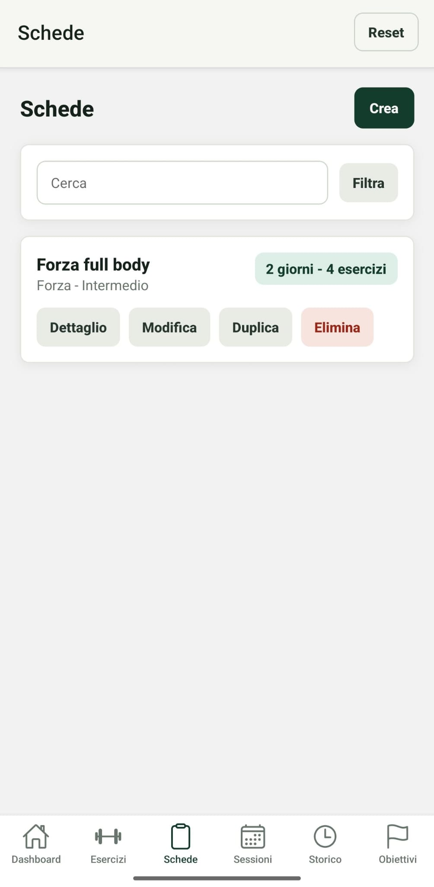
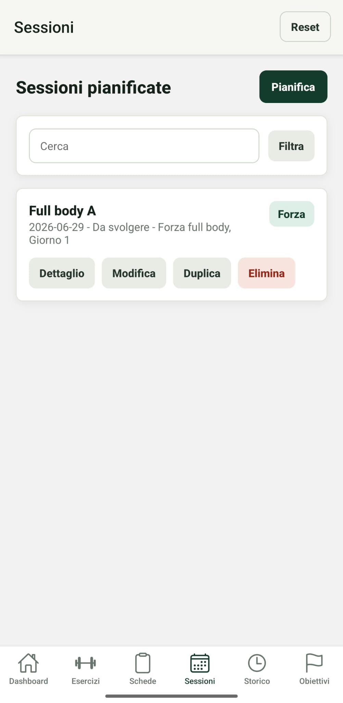
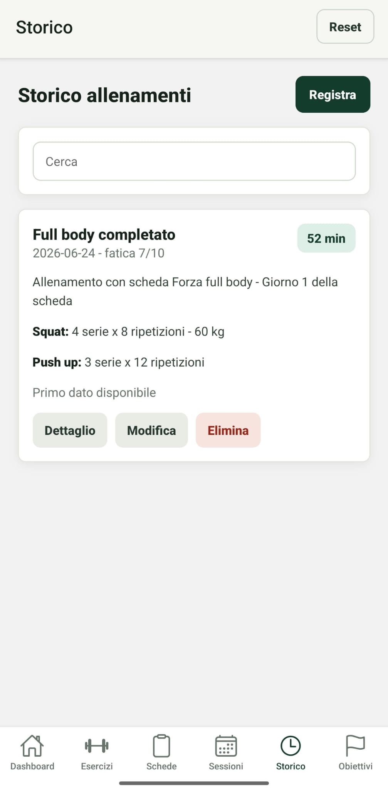
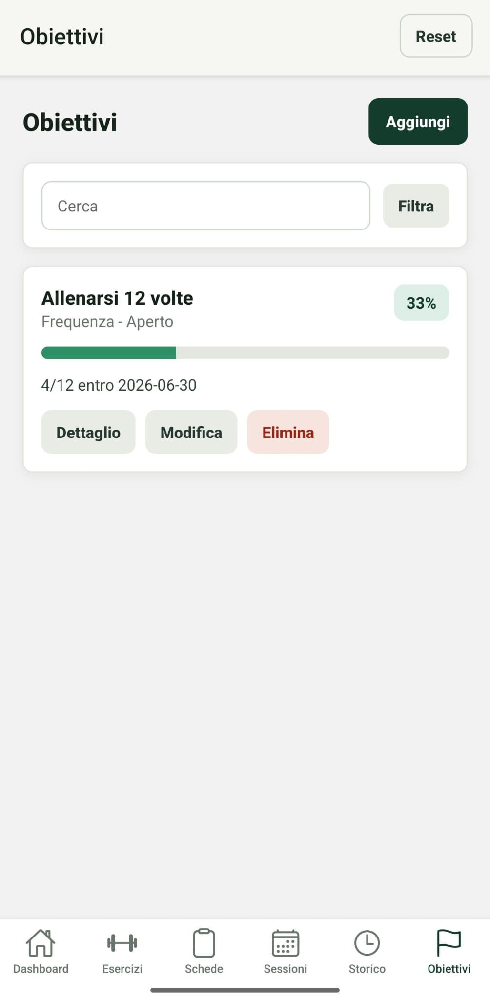

# Relazione tecnica - FitTrackPro

## 1. Descrizione dell'app

FitTrackPro e' un'app mobile sviluppata in React Native con Expo. L'obiettivo dell'app e' aiutare l'utente a organizzare la propria attivita' fisica attraverso la gestione di esercizi, schede di allenamento, sessioni pianificate, allenamenti svolti e obiettivi personali.

L'app e' pensata per utenti che si allenano in autonomia e vogliono uno strumento semplice per pianificare gli allenamenti, registrare cio' che e' stato svolto e controllare i progressi nel tempo. Non e' progettata come piattaforma professionale per personal trainer o palestre, ma come tracker personale locale, utilizzabile anche senza connessione a Internet.

Il problema principale affrontato e' la frammentazione delle informazioni relative all'allenamento. Molto spesso esercizi, schede, sessioni e progressi vengono salvati in note separate o in modo poco strutturato. FitTrackPro raccoglie questi dati in sezioni coerenti e permette all'utente di consultarli, modificarli e collegarli tra loro.

Gli scenari d'uso principali sono:

- creare un archivio personale di esercizi;
- costruire schede di allenamento divise per giorni;
- associare a ogni giorno esercizi, serie e ripetizioni;
- pianificare sessioni future partendo da una scheda;
- indicare se una sessione e' da svolgere, completata o saltata;
- registrare gli allenamenti effettivamente svolti;
- salvare il carico usato per i singoli esercizi;
- creare obiettivi personali e seguirne l'avanzamento;
- registrare rapidamente l'allenamento previsto per il giorno corrente;
- consultare una dashboard con riepiloghi, costanza settimanale e timer di recupero.

## 2. Requisiti

### 2.1 Funzionalita' implementate

FitTrackPro implementa le principali funzionalita' richieste dalla traccia progettuale.

La sezione **Esercizi** permette di visualizzare l'elenco degli esercizi, consultare il dettaglio, aggiungere nuovi esercizi, modificarli ed eliminarli. Per ogni esercizio vengono gestiti nome, descrizione, gruppo muscolare principale, gruppi secondari, difficolta', attrezzatura, serie consigliate, ripetizioni consigliate, durata stimata e note. Il gruppo muscolare principale e i gruppi secondari vengono scelti da liste controllate, cosi' da evitare valori incoerenti o scritti in modo diverso.

La sezione **Schede** permette di creare, modificare, eliminare e duplicare schede di allenamento. Ogni scheda contiene nome, descrizione, obiettivo, livello, durata prevista, frequenza settimanale, recupero generale, note e una programmazione divisa per giorni. Ogni giorno contiene esercizi collegati all'archivio, con serie e ripetizioni specifiche.

La sezione **Sessioni** consente di pianificare allenamenti futuri. Una sessione contiene titolo, data, tipo, scheda associata, giorno della scheda, stato e note. Gli esercizi della sessione non vengono inseriti manualmente: sono ricavati automaticamente dal giorno scelto nella scheda. Questa scelta rende la pianificazione piu' coerente, perche' una sessione collegata a una scheda eredita il programma previsto.

La sezione **Storico** consente di registrare gli allenamenti svolti. Ogni allenamento contiene titolo, data, scheda associata, giorno svolto, durata, carico opzionale per singolo esercizio, fatica percepita da 1 a 10 e note. Quando viene registrato un allenamento collegato a una sessione prevista nello stesso giorno, la sessione passa automaticamente da "Da svolgere" a "Completata". Lo storico mostra anche un confronto semplice con l'allenamento precedente, basato sulla differenza di durata.

La sezione **Obiettivi** consente di creare, modificare, visualizzare ed eliminare obiettivi personali. Ogni obiettivo contiene titolo, descrizione, categoria, valore target, valore attuale, data di inizio, eventuale scadenza, stato e note. La categoria non e' un testo libero, ma una scelta controllata: manuale, numero allenamenti, minuti totali, frequenza settimanale, carico su esercizio o completamento scheda. L'avanzamento viene mostrato tramite percentuale e barra di progresso. Per gli obiettivi automatici il valore attuale viene calcolato dagli allenamenti salvati, dai carichi registrati o dalle schede collegate. Quando il valore attuale raggiunge o supera il target, l'obiettivo viene considerato raggiunto. Se invece la data di fine viene superata senza raggiungere il target, l'obiettivo viene impostato come fallito.

La **Dashboard** mostra un riepilogo generale con numero di esercizi, numero di schede, sessioni nella settimana, allenamenti registrati, minuti totali di allenamento e obiettivi raggiunti. Include una card di ingresso rapido che propone la scheda programmata per oggi e apre direttamente la registrazione dell'allenamento. Mostra inoltre icone nei riquadri statistici, una riga di costanza settimanale colorata in base agli allenamenti registrati, la distribuzione compatta degli esercizi per gruppo muscolare e un timer di recupero.

### 2.2 Ricerca, filtri e organizzazione

Sono state implementate funzioni di ricerca e filtro in piu' sezioni:

- ricerca degli esercizi per nome;
- filtro degli esercizi per gruppo muscolare o difficolta';
- ricerca delle schede per nome, obiettivo o livello;
- filtro delle schede per obiettivo o livello;
- ricerca delle sessioni per titolo, data, tipo, stato, scheda, giorno o esercizi;
- filtro delle sessioni per stato o tipo;
- ricerca nello storico allenamenti per titolo, data, note, scheda, giorno o esercizi;
- ricerca degli obiettivi per titolo, categoria o stato;
- filtro degli obiettivi per categoria o stato.

I filtri sono organizzati in una finestra dedicata con sezioni separate. Quando un filtro e' attivo, l'app lo mostra esplicitamente all'utente.

### 2.3 Feature avanzate implementate

Sono state implementate due feature avanzate principali.

La prima e' il **timer di recupero**, presente nella dashboard. L'utente puo' avviare o mettere in pausa il timer, scegliere rapidamente durate predefinite di 1:30 o 3:00 minuti e aumentare il tempo con un pulsante +30s. La funzione e' coerente con il dominio dell'app, perche' il recupero tra le serie e' una parte importante dell'allenamento.

La seconda e' la **duplicazione di schede e sessioni**. L'utente puo' duplicare una scheda o una sessione esistente per creare rapidamente una variante. Il sistema genera nuovi identificativi e assegna un nome non duplicato, ad esempio aggiungendo "copia" o "copia 2".

Sono state inoltre implementate validazioni robuste sui dati, migrazioni per dati salvati con versioni precedenti, inserimento automatico dei trattini nelle date, conferme compatibili anche con la versione web e aggiornamenti automatici tra storico, sessioni e obiettivi.

### 2.4 Funzionalita' considerate ma non implementate

Sono state considerate alcune funzionalita' ulteriori, ma non inserite nella versione attuale:

- grafici avanzati sull'andamento dei carichi;
- calendario mensile completo;
- notifiche locali per ricordare le sessioni pianificate;
- autenticazione utente;
- sincronizzazione online;
- backend remoto;
- esportazione dei dati.

Queste funzionalita' richiederebbero librerie aggiuntive o un'infrastruttura piu' complessa. Per questa versione si e' scelto di mantenere l'app locale, stabile e coerente con i requisiti principali.

## 3. Progettazione dell'app

### 3.1 Struttura generale

L'app e' organizzata in sei sezioni principali:

- Dashboard;
- Esercizi;
- Schede;
- Sessioni;
- Storico;
- Obiettivi.

La navigazione e' gestita con React Navigation. Il progetto usa un `NavigationContainer`, uno Stack Navigator principale e un Bottom Tab Navigator per le sezioni dell'app. Questa scelta rispetta il vincolo della traccia sulla navigazione tra piu' schermate e rende la struttura piu' vicina a quella di una vera applicazione mobile.

La struttura principale del progetto e':

```text
FitTrackPro/
  App.tsx
  index.ts
  src/
    components/
      common.tsx
      detail-modal.tsx
      edit-modal.tsx
      form-controls.tsx
      modals/
        detail/
          exercise-detail-modal.tsx
          goal-detail-modal.tsx
          plan-detail-modal.tsx
          session-detail-modal.tsx
          workout-detail-modal.tsx
        edit/
          exercise-edit-modal.tsx
          goal-edit-modal.tsx
          plan-edit-modal.tsx
          session-edit-modal.tsx
          workout-edit-modal.tsx
    screens/
      dashboard-screen.tsx
      exercises-screen.tsx
      plans-screen.tsx
      sessions-screen.tsx
      workouts-screen.tsx
      goals-screen.tsx
    constants.ts
    goals.ts
    seed.ts
    storage.ts
    input-sanitizers.ts
    styles.ts
    types.ts
    utils.ts
    validation.ts
```

### 3.2 Schermate principali e flusso di navigazione

Il flusso principale parte dalla dashboard. L'utente puo' poi spostarsi tra le sezioni tramite la barra di navigazione inferiore.

Ogni sezione presenta un elenco di elementi e azioni coerenti:

- visualizzazione del dettaglio;
- creazione di un nuovo elemento;
- modifica di un elemento esistente;
- eliminazione con conferma;
- duplicazione dove prevista.

La visualizzazione del dettaglio e la modifica avvengono tramite modali. Questa scelta mantiene il flusso semplice: l'utente lavora sul dato rimanendo nel contesto della sezione corrente. Dal punto di vista progettuale le modali sono organizzate per entita': esercizi, schede, sessioni, allenamenti e obiettivi hanno file separati per inserimento/modifica e per dettaglio. I file `edit-modal.tsx` e `detail-modal.tsx` restano come dispatcher leggeri, cioe' scelgono quale modale specifica aprire in base all'entita' selezionata.

Schema sintetico della navigazione:

```text
App
  NavigationContainer
    Stack Navigator
      MainTabs
        Dashboard
        Esercizi
        Schede
        Sessioni
        Storico
        Obiettivi
```

### 3.3 Organizzazione dei dati

I tipi principali sono definiti in `src/types.ts`. Le entita' gestite sono:

- `Exercise`;
- `WorkoutPlan`;
- `WorkoutPlanDay`;
- `PlannedSession`;
- `WorkoutLog`;
- `FitnessGoal`.

Tutti i dati sono raccolti nel tipo `FitnessData`, che contiene gli array delle entita'. Ogni elemento ha un campo `id`, usato per modifica, eliminazione e collegamento con altri dati.

Il legame tra schede, sessioni, storico ed esercizi e' basato sugli identificativi:

- una scheda contiene piu' giorni di allenamento;
- ogni giorno contiene esercizi collegati tramite `exerciseId`;
- ogni esercizio del giorno contiene serie e ripetizioni;
- una sessione contiene `planId` e `planDayId`;
- uno storico allenamento contiene `planId`, `planDayId` e carichi per singolo esercizio della scheda.
- un obiettivo puo' contenere riferimenti opzionali a un esercizio o a una scheda, usati per calcolare obiettivi come carico su esercizio o completamento scheda.

Questa scelta evita di duplicare oggetti complessi e mantiene i dati piu' coerenti. Se il nome di un esercizio cambia, le schede continuano a riferirsi allo stesso esercizio tramite identificativo.

### 3.4 Mockup e schermate dell'interfaccia

Per documentare l'interfaccia sono stati inseriti screenshot delle schermate principali dell'app. Gli screenshot non rappresentano wireframe preliminari, ma mockup dell'interfaccia finale: mostrano quindi il risultato effettivo dell'implementazione e aiutano a comprendere la disposizione dei contenuti, la navigazione e le principali azioni disponibili.

Le schermate incluse sono:

- dashboard principale, con ingresso rapido all'allenamento, riepiloghi, costanza settimanale e timer di recupero;
- elenco esercizi, con card, ricerca, filtri e azioni disponibili;
- modale di aggiunta esercizio, con campi controllati e selettori;
- sezione schede, con elenco delle schede di allenamento;
- sezione sessioni, dedicata alla pianificazione degli allenamenti;
- storico allenamenti, con riepilogo degli allenamenti svolti;
- sezione obiettivi, con stato di avanzamento e barra di progresso.















## 4. Scelte tecnologiche

### 4.1 Framework utilizzato

L'app e' stata sviluppata con React Native tramite Expo. Le versioni principali, lette dal file `package.json`, sono:

- Expo SDK 54 (`expo` 54.0.0);
- React Native 0.81.5;
- React 19.1.0;
- React DOM 19.1.0;
- TypeScript 5.9.2.

Expo e' stato scelto per semplificare sviluppo, avvio e test su dispositivo fisico tramite Expo Go o su emulatore.

### 4.2 Librerie principali

Le dipendenze principali sono:

- `expo`;
- `react` 19.1.0;
- `react-dom` 19.1.0;
- `react-native` 0.81.5;
- `react-native-web` 0.19.13;
- `expo-status-bar` 2.0.1;
- `@react-navigation/native` 7.0.0;
- `@react-navigation/native-stack` 7.0.0;
- `@react-navigation/bottom-tabs` 7.0.0;
- `@react-native-async-storage/async-storage` 2.1.1;
- `@expo/vector-icons` 15.0.2;
- `react-native-screens` 4.4.0;
- `react-native-safe-area-context` 4.12.0.

React Navigation gestisce il passaggio tra schermate. AsyncStorage gestisce la persistenza locale. `@expo/vector-icons` viene usata per rendere piu' chiara la barra di navigazione inferiore tramite icone associate alle singole sezioni. Non sono usate API remote o backend, perche' la traccia non li richiede.

### 4.3 Persistenza locale

La persistenza e' implementata in `src/storage.ts`. All'avvio l'app prova a caricare i dati salvati localmente. Se non sono presenti dati, vengono caricati dati dimostrativi definiti in `src/seed.ts`.

Ogni modifica viene salvata in AsyncStorage serializzando l'oggetto `FitnessData` in JSON. Il file di storage contiene anche una normalizzazione dei dati, utile per mantenere compatibili dati salvati con strutture precedenti, ad esempio:

- schede vecchie senza giorni;
- sessioni vecchie senza giorno della scheda;
- storico vecchio con carico globale;
- gruppi muscolari vecchi come "Core" o "Addominali".
- obiettivi scaduti non completati, che vengono normalizzati nello stato "Fallito".

## 5. Implementazione

### 5.1 Organizzazione del codice

`App.tsx` contiene la configurazione della navigazione e la logica principale dell'app.

In particolare gestisce:

- dati dell'app;
- statistiche calcolate;
- stato del timer;
- collegamento rapido alla sessione del giorno;
- creazione e modifica delle entita';
- eliminazione;
- duplicazione di schede e sessioni;
- apertura dei dettagli;
- reset dei dati demo.

Le schermate ricevono dati e funzioni tramite props passate dai componenti route definiti in `App.tsx`. Questa scelta rende il flusso piu' esplicito: lo stato principale e' in un solo file, mentre le schermate restano componenti di presentazione e interazione.

I componenti riutilizzabili sono nella cartella `src/components`:

- `common.tsx` contiene card, azioni, ricerca, filtri e statistiche;
- `form-controls.tsx` contiene campi input, chip e selettori e applica la sanitizzazione durante la digitazione;
- `edit-modal.tsx` contiene il dispatcher delle modali di inserimento e modifica;
- `detail-modal.tsx` contiene il dispatcher delle modali di dettaglio;
- `src/components/modals/edit` contiene una modale di modifica separata per ogni entita';
- `src/components/modals/detail` contiene una modale di dettaglio separata per ogni entita' e un piccolo contenitore comune per overlay, scroll e pulsante di chiusura;
- `goals.ts` contiene il calcolo centralizzato dello stato di avanzamento degli obiettivi.

Gli stili sono centralizzati in `src/styles.ts`, cosi' da mantenere coerenza visiva tra le sezioni.

### 5.2 Gestione dello stato

Lo stato e' gestito con hook React: `useState`, `useEffect` e `useMemo`.

Gli stati principali sono:

- dati dell'app (`FitnessData`);
- elemento in modifica;
- elemento selezionato per il dettaglio;
- caricamento iniziale;
- timer di recupero;
- ricerca e filtro locali alle singole schermate.

`useEffect` viene usato per caricare i dati all'avvio e per gestire l'intervallo del timer. `useMemo` viene usato per calcolare statistiche derivate, come minuti totali, obiettivi raggiunti e distribuzione degli esercizi per gruppo muscolare.

### 5.3 Inserimento, modifica e cancellazione

L'inserimento e la modifica avvengono tramite modali specifiche per entita'. `EditModal` riceve lo stato dell'elemento in modifica e delega a `ExerciseEditModal`, `PlanEditModal`, `SessionEditModal`, `WorkoutEditModal` o `GoalEditModal`. In questo modo ogni file contiene solo la logica del proprio form, mentre il flusso di apertura e salvataggio rimane centralizzato.

La cancellazione richiede conferma. Su mobile viene usato `Alert`, mentre su web vengono usate le API native del browser tramite `globalThis.confirm`, cosi' da mantenere lo stesso comportamento anche quando l'app viene eseguita con Expo Web.

La visualizzazione dei dettagli segue la stessa organizzazione: `DetailModal` delega a una modale specifica per l'entita' selezionata. Questa separazione rende il codice piu' leggibile e riduce il rischio che una modifica agli obiettivi interferisca con schede, esercizi o allenamenti.

Il salvataggio passa dalla funzione di validazione centralizzata. Se il dato non e' valido, l'app mostra un messaggio di errore e mantiene aperta la modale, permettendo all'utente di correggere l'input. Anche in questo caso il messaggio e' gestito in modo compatibile con web e mobile.

### 5.4 Validazione e controllo degli input

Il controllo degli input opera su due livelli complementari.

Il primo livello e' applicato durante la digitazione ed e' centralizzato in `src/input-sanitizers.ts`. Il componente riutilizzabile `Field`, definito in `src/components/form-controls.tsx`, riceve una tipologia esplicita di input e filtra immediatamente il valore prima di aggiornare lo stato. In questo modo il controllo vale anche per i dati incollati e non dipende soltanto dalla tastiera visualizzata dal dispositivo.

Le tipologie gestite sono:

- `integer`: accetta esclusivamente cifre; segni `+` e `-`, lettere, punti, virgole e altri simboli vengono rimossi;
- `decimal`: accetta cifre e un solo separatore decimale, con massimo due cifre decimali; i segni non sono ammessi;
- `date`: accetta soltanto cifre e inserisce automaticamente i trattini nel formato `YYYY-MM-DD`;
- `name`: accetta lettere accentate, numeri, spazi, apostrofo e trattino;
- `list`: accetta testo controllato e virgole per separare piu' elementi;
- `shortText`, `longText` e `search`: rimuovono caratteri invisibili, tabulazioni e simboli non pertinenti e applicano limiti di lunghezza.

Tutti i campi compilabili della modale dichiarano la propria tipologia. La barra di ricerca usa a sua volta la stessa sanitizzazione. `keyboardType` e `inputMode` migliorano l'esperienza d'uso, mentre il filtro applicato in `onChangeText` costituisce il controllo effettivo.

Il secondo livello e' centralizzato in `src/validation.ts` e viene eseguito al salvataggio. Sono presenti controlli per evitare:

- campi obbligatori vuoti;
- nomi composti solo da spazi o caratteri speciali;
- duplicati su esercizi, schede, sessioni, allenamenti e obiettivi;
- date inesistenti o nel formato errato;
- numeri negativi, decimali o fuori intervallo dove non consentiti;
- serie oltre 100 e ripetizioni oltre 10.000;
- durata oltre 1.440 minuti;
- frequenza settimanale oltre 14 e recupero oltre 3.600 secondi;
- carichi superiori a 1.000 kg o con piu' di due decimali;
- fatica percepita diversa da un intero compreso tra 1 e 10;
- target e valori attuali superiori a 1.000.000 o con piu' di due decimali;
- schede senza giorni, giorni senza esercizi e duplicazioni interne;
- riferimenti a schede, giorni o esercizi non esistenti;
- scadenze degli obiettivi precedenti alla data di inizio;
- testi oltre i limiti previsti.

I testi vengono inoltre normalizzati rimuovendo spazi iniziali, finali e sequenze multiple di spazi. Questa scelta evita duplicati apparenti, come "Squat" e "  Squat  ".

### 5.5 Gestione delle date

Le date sono salvate come stringhe nel formato `YYYY-MM-DD`. L'input inserisce automaticamente i trattini durante la digitazione: ad esempio `20260627` diventa `2026-06-27`.

La validazione non usa conversioni UTC tramite `toISOString`, per evitare errori dovuti al fuso orario. La data viene controllata confrontando anno, mese e giorno in locale.

### 5.6 Riepiloghi e statistiche

La dashboard calcola e mostra:

- numero totale di esercizi;
- numero totale di schede;
- sessioni pianificate nella settimana;
- numero di allenamenti registrati;
- minuti totali di allenamento;
- obiettivi raggiunti rispetto al totale;
- costanza settimanale basata sulle date degli allenamenti registrati;
- distribuzione degli esercizi per gruppo muscolare.

Questi dati sono ricavati localmente dagli array salvati nell'app.

### 5.7 Aggiornamenti automatici tra entita'

Alcune azioni dell'utente aggiornano piu' entita' in modo coordinato. La registrazione di un allenamento puo' completare automaticamente la sessione pianificata corrispondente, quando data, scheda e giorno della scheda coincidono. Inoltre gli obiettivi automatici vengono ricalcolati partendo dagli allenamenti salvati nel periodo definito da data di inizio e scadenza.

Le categorie automatiche gestite sono: numero allenamenti, minuti totali, frequenza settimanale, carico su esercizio e completamento scheda. Gli obiettivi manuali restano aggiornabili dall'utente. Gli obiettivi vengono normalizzati sia al caricamento dei dati sia durante il salvataggio: se il valore attuale raggiunge il target diventano "Raggiunto"; se la data di fine e' passata e il target non e' stato raggiunto diventano "Fallito". Gli obiettivi falliti o raggiunti non vengono avanzati automaticamente da nuovi allenamenti.

## 6. Limitazioni note

L'app non utilizza backend remoto e quindi i dati restano sul dispositivo. In caso di disinstallazione dell'app o cancellazione dei dati locali, le informazioni possono andare perse.

Le statistiche sono volutamente semplici: non includono grafici avanzati sull'andamento dei carichi o analisi per periodo. Sono comunque coerenti con la richiesta di avere riepiloghi e indicatori visuali.

La pianificazione delle sessioni e' collegata alle schede e ai giorni della scheda. Questo rende i dati coerenti, ma limita la possibilita' di creare sessioni completamente libere senza scheda associata.

Gli obiettivi automatici coprono le categorie principali previste dall'app: allenamenti, minuti, frequenza, carichi su esercizio e completamento scheda. Obiettivi non riconducibili a queste categorie, ad esempio misure corporee o valutazioni personali, restano gestibili tramite categoria manuale.

## 7. Istruzioni per l'esecuzione

Per eseguire il progetto e' necessario avere Node.js installato.

Dalla cartella del progetto:

```powershell
cd percorso\FitTrackPro
npm install
npx expo start
```

L'app puo' essere aperta con Expo Go scansionando il QR code oppure tramite un emulatore Android/iOS configurato.

Per controllare che il codice TypeScript non contenga errori:

```powershell
npx tsc --noEmit
```

Per controllare l'allineamento delle dipendenze Expo:

```powershell
npx expo install --check
```

## 8. Verifiche effettuate

Durante il controllo finale sono state eseguite le seguenti verifiche:

- lettura della traccia progettuale;
- controllo della struttura del progetto;
- controllo delle dipendenze principali;
- verifica TypeScript con `npx tsc --noEmit`;
- verifica Expo con `npx expo install --check`;
- controllo dell'assenza di residui della precedente navigazione manuale;
- controllo dell'assenza di riferimenti a Expo Router, non usato nella versione finale;
- controllo dei campi `Field`, ciascuno con una tipologia di input esplicita;
- controllo dei soli due punti di creazione diretta di `TextInput`, entrambi protetti dalla sanitizzazione;
- generazione del bundle Android con `npx expo export --platform android`.

Le verifiche TypeScript ed Expo risultano superate.

## 9. Conclusioni

FitTrackPro soddisfa i requisiti principali della traccia: gestisce esercizi, schede di allenamento, sessioni pianificate, storico degli allenamenti e obiettivi personali. Include ricerca, filtri, riepiloghi, persistenza locale, navigazione tra piu' schermate e almeno due feature avanzate integrate nel dominio dell'app.

Le scelte piu' significative sono la navigazione con React Navigation, la gestione centrale dello stato in `App.tsx`, la modellazione delle schede in giorni di allenamento e il collegamento coerente tra schede, sessioni e storico. Il risultato e' un'app usabile, organizzata e coerente con l'obiettivo di un fitness tracker personale.
